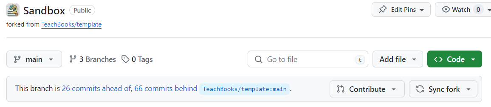
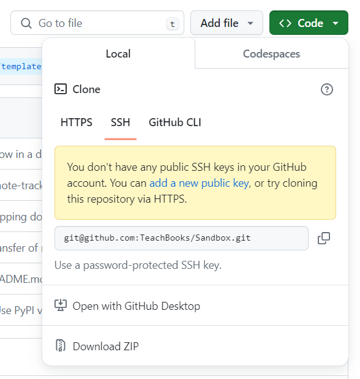
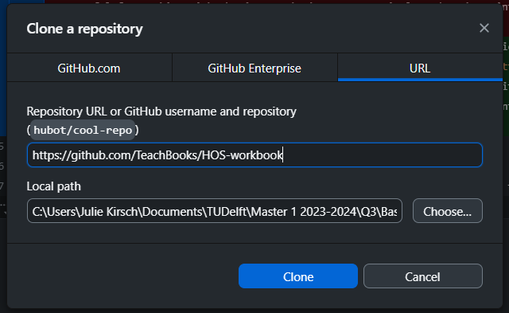

# Create your own version (branching, cloning, pulling)

Branches are a very useful feature of Git. Branches allow you to work on multiple versions of your codebase simultaneously; you create a copy of your codebase, on which you can work independently of the main codebase. The main branch is the default branch. The content on this branch will be the most up to date version of the book. Therefore, new branches, which are made to add or fix some content in the book, are usually cloned from the main branch. This has many advantages compared to making the edits immediately in the main branch.  Some advantages of working with branches are:

- Isolation: when you work on your own branch, your changes are isolated from the main codebase. Unfinished or unreviewed parts of your book are "hidden". Your own branch helps to keep an overview of the changes made to the book. 
- Collaboration: branches make it easier for multiple project members to work on the same codebase simultaneously. If every member works on their own branch, they can make their changes without having to worry about interfering with another members' changes. In case those changes made in parallel lead to conflicts, they can be resolved during the merging of the branches. 

This systematic workflow guarantees that editing the book goes smoothly. 

The act of making a new branch from an existing one is called *branching*. Usually, you want to branch from the `main` branch, but you can of course also choose to branch from another branch. The branch from which you create a new branch is called the *source* branch.

**Create your own version as ...**

`````````{tab-set}

````````{tab-item} ... user type 3 ...

**... by (1) directly creating your own version of the book (branching) or <br> 
      by (2) selecting an existing version in ...**

`````{tab-set}

````{tab-item} ... GitLab

1. Navigate to the repository of your project. Under the project description, you should see a menu button with a "+" in it (see {numref}`new-branch-button`). Click this button, then click on "New branch".

```{figure} ../images/gitlab-branch.png
:name: new-branch-button

Click the highlighted button to make a new branch.
```

2. A new page opens ({numref}`new-branch-menu`), on which you can specify the name of your branch and the source branch. Try to think of a good name for your branch. For example, `chapter-2` is a suitable name if we're going to be working on Chapter 2 of our book. After you've made sure that the selected source branch is correct, click "Create branch".

```{figure} ../images/gitlab-branch-name.png
:name: new-branch-menu

We're making a new branch called `chapter-2` from the `main` branch.
```

3. You should be sent back to an overview page of your repository. In the branch selection menu (see {numref}`new-branch-repo`), it should now say `chapter-2` instead of `main`. Here you can also select another existing branch which is what we previously called `selecting an existing version`.

```{figure} ../images/gitlab-new-branch-repo.png
:name: new-branch-repo

The circled menu is the branch selection menu. 
```
````

````{tab-item} ... GitHub

1. Open the repository in which you want to work in. In the top bar you will see your current branch `main` and next to that there is a tab called `Branches`. 

```{figure} ../figures/NewBranch_GitHub.PNG
```
2. Clicking on `Branches` will bring you to an overview of all the branches in the repository. Click on the green `Create Branch` button.

```{figure} ../figures/NewBranch_GitHub2.PNG
```
3. Finally, give your branch a name and specifiy the source branch. <br>
Tip: It makes sense to give the branch a name related to the content you will be creating or altering.

```{figure} ../figures/NewBranch_GitHub3.PNG
```
4. You will find your new branch in the drop down menu as seen on the figure below. You can then select your new branch and start working in it (new version) but you can also work in any other branch if you are helping out a colleague with their chapter for example (existing version).

```{figure} ../figures/NewBranch_GitHub4.PNG
```
````
`````
````````

````````{tab-item} ... user type 4 and 5 ...

As user type 4 and 5, you make changes to the book locally on your computer rather than online on GitLab/GitHub. This allows you to create more complex and interactive sections to your book. Before you can start, there are a few preparatory steps you need to take. 

**Cloning**

In order to create your own version, you will first have to open the repositery. Then, you will need to clone the repositery to your computer. This procedure is called cloning.

**Branching**

If your repositery is already cloned on your computer, you are almost ready to start editing the book. However, remember that you are most likely not the only person making changes to the book. To keep an overview of the changes made by you and your colleages, it is important that changes are first made in a 'copy' of the book and are then merged into the final version. This is done through branching! You can create your version of the book by creating a new version (branch) or you can continue the work in an existing version (checkout branch). 

```````{tab-set}

``````{tab-item} Cloning

**1. Open the repository locally using ...**

`````{tab-set}

````{tab-item} ... GitLab

1. Navigate to the repository of your book. Click on the blue button that says "Clone" ({numref}`gitlab-clone`), and copy the link under "Clone with SSH".

```{figure} ../images/gitlab-clone.png
:name: gitlab-clone

The cloning menu.
```
````

````{tab-item} ... GitHub

1. Open the repository that you would like to clone. In the top bar on the right, you will a green button called `<> Code`.

<figure align="center">
    
</figure>

2. Clicking on the button will display the following screen. Make sure the option `SSH` is selected and copy the link.

<figure align="center">
    
</figure>
````

````{tab-item} ... GitHub through GitHub Desktop

1. Open the repository that you would like to clone. In the top bar on the right, you will a green button called `<> Code`.

<figure align="center">
    
</figure>

2. Clicking on the button will display the following screen. Click on `Open with GitHub Desktop`.

<figure align="center">
    
</figure>

3. The Browser should then automatically open GitHub Desktop. Customize the path to the location where you would like to save to files locally. Finally, click on `Clone`.

<figure align="center">
    
</figure>

You have now directly cloned the repository, so you can skip the next step!
````
`````

**2. Clone the local repositery with ...**

`````{tab-set}
````{tab-item} ... VS Code

1. Open a new VS Code window. You should be greeted with a welcome page ({numref}`vscode-welcome`). On this page, click "Clone Git Repository". Alternatively, open the Source Control menu from the left side bar, and click on "Clone Repository".

```{figure} ../images/vscode-welcome.png
:name: vscode-welcome

The VS Code welcome screen.
```

2. On the top of your screen, you should get a prompt asking you for a URL. In this field, paste the link you copied from GitLab and press enter. It will ask you to choose the location of the repository. After you've chosen a location, a final prompt will show up asking if you want to open the repository. Click on "Open".

3. You now have a local copy of the repository.
4. Now you can start branching. Have a look at the other section!
````

````{tab-item} ... GitHub Desktop

1. You have previously copied the link of the repositery you would like to clone from GitLab or GitHub. In GitHub Desktop, navigate to the top bar, click on `File` and then on `Clone repositery`.

<figure align="center">
    
</figure>

2. In the top bar click on `URL`.

<figure align="center">
    
</figure>

3. Simply paste the link, specify the working directory (location where you would like to save the folder locally) and click on 'Clone'.

4. You now have a local copy of the repository.

5. Now you can start branching. Have a look at the other section!

````
`````
**You have now cloned the repositery to your computer and you can start branching. <br> 
Have a look at the other section!**
``````

``````{tab-item} Branching

**I want to... <br>
(1) update my repository (pulling) and <br>
(2) create my own version (branching) or select an existing version (checkout branch) using ...**

`````{tab-set}
````{tab-item} ... Git in VS Code

1. The next step is to *check out* our new branch in VS Code. *Checking out* means that we're changing our working branch (i.e., the one to which we will be committing our changes) from one to the other. 

In VS Code, open the branch menu from the bottom left (see {numref}`git-branch-menu-main`). You'll be be greeted with a menu that looks like the one in {numref}`git-branch-selection-menu`. In this menu, we get an overview of the branches of our repository. Notice that our new branch `chapter-2` appears as `origin/chapter-2`, and has a cloud icon in front of it. This means that the branch only exists on the remote repository. 

Check out the branch by simply clicking on it. Check that the branch is indeed checked out by looking at the branch menu button in the bottom left again; it should now say the name of your branch instead of `main` (in our case `chapter-2`). 

```{figure} ../images/git-branch-menu-main.png
:name: git-branch-menu-main

Location of the branch menu.
```

```{figure} ../images/git-branch-selection-menu.png
:name: git-branch-selection-menu

The branch selection menu, where our new branch has shown up. From this menu you can also select (checkout in git terms) another existing branch.
```

2. It can be that multiple people ar making changes to one branch. We have to make sure that we are using the most up to date version of the branch. Therefore, we need to pull all the changes from the remote repositery to our local repositery. Simply click the Icon with the two arrows.

```{figure} ../figures/Pull_VS.png
:name: Pull_VS

Location of the branch menu.
```

````
````{tab-item} ... GitHub Desktop

1. The next step is to *check out* our new branch. *Checking out* means that we're changing our working branch (i.e., the one to which we will be committing our changes) from one to the other. 

In GitHub Desktop, the top bar has a menu called `Current Branch`. By clicking on it you can see all the branches you created on the remote repositery. 


```{figure} ../figures/CheckOutBranch_GitHubDesktop.PNG
```
2. Check out the branch by simply clicking on it. The following window will pop up.

```{figure} ../figures/CheckOutBranch_GitHubDesktop2.PNG
```
Leave your changes (stashed) on your working branch, in this case I was working in the branch called `collaboration git`.

3. Check that the branch is indeed checked out by looking at the branch menu at the the top left again; the current branch should say the name. 

````
`````
Now that we've created and checked out our new branch, we can start {ref}`making and committing changes <stage-commit-push>`.
``````
```````
````````
`````````
