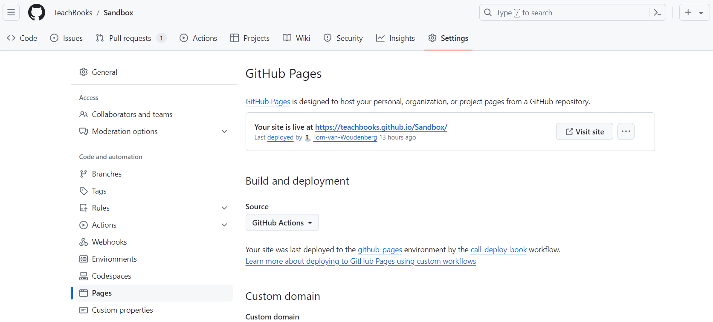

# Check changes online

```{Note}

This page is relevant for user type 4 and 5. When making changes to the book it can be useful to get an idea on how they will be realized in the online book. Whereas user type 5 can also build the book locally, user type 4 is more focused on the changes to the content.

However both users would certainly benefit from checking whether their changes look good in the book!
```

Now that you've pushed your changes online, it's time to check the change in the online build book to make sure that your changes are processed correctly. For this step it is assumed you're using TeachBook's GitHub actions or TeachBook's GitLab pipeline.

`````{tab-set}
````{tab-item} In GitLab

At the moment this is not possible, but the workflow will soon be the same as for GitHub.
````
````{tab-item} In GitHub

1. Enable GitHub Pages on your repositery. Note that if you use the Teachbooks template this is probably already done!

2. Once your book files are pushed to your GitHub repository you can view the book. Make sure you wait for the action to finish (GitHub Desktop shows progress if its part of a pull request, VS Code shows progress with the GitHub Actions addon).

3. Viewing the Book: Once GitHub Pages is enabled and your book is published, you can view it by visiting the GitHub Pages URL for your repository. The URL will typically be in the format https://<username>.github.io/<repository-name>.

Alternatively you can find it in the settings

- Go to your GitHub repository's settings.
- Scroll down to the "GitHub Pages" section (left side-bar: pages)
- Copy the link or click on `Visit site`

<figure align="center">
    
</figure>
`````

You can keep on [editing](edit_book) and checking your changes until you're satisfied and ready for a review by a colleague.