# Edit (merge conflicts, staging, committing, pushing)

Suppose we are writing a new chapter, or are updating an existing chapter for our Jupyter Book. We've created a new branch on which we are going to make the changes.

**Edit files as ...**
`````````{tab-set}
````````{tab-item} ... user type 3 ...

**... by directly adding changes on a single file to the Git-timeline (committing) in ...**

`````{tab-set}
````{tab-item} ... GitLab

In GitLab, you can directly make changes in the files on the remote repositery. You can make changes to the files already in the repositery using the text editor but you can also upload new files!

1. Navigate to the repositery you want to work in.

2. Create a new file by clicking on the plus button in the top bar. You can either create an entirely new file by clicking `New File` or if you already have created a file you can upload it by clicking `Upload File`.

<figure align="center">
    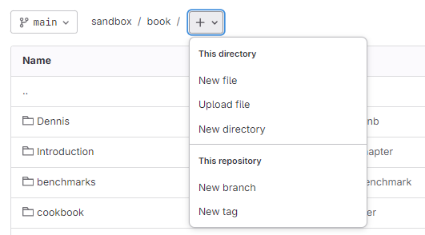
</figure>

3. In the new window, you can start typing your content. Give your file a name and make sure to use the markdown extension: `Chapter1.md`. Once you are done, commit the new file to the repositery by clicking the blue button `Commit changes`.

<figure align="center">
    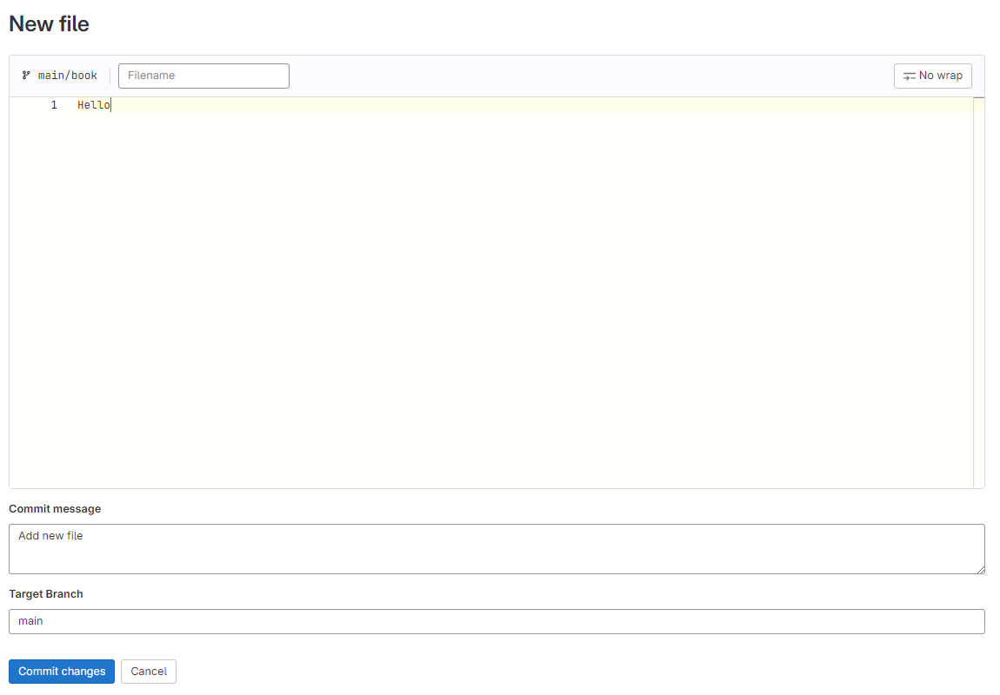
</figure>

4. In case you want to make changes to an existing file, navigate to the file in your remote repositery. Then click the blue button called `Edit` and select the option `Edit single file`.

<figure align="center">
    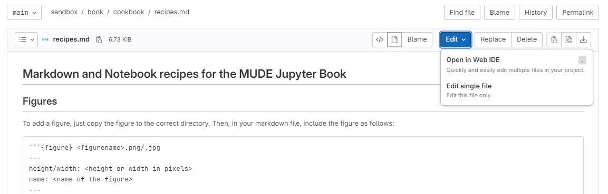
</figure>

5. Make your changes in the text editor and when you are ready, commit your changes to the remote repositery by clicking on the blue `Commit changes` button.

<figure align="center">
    
</figure>

6. In case you added a new file, you also need to include it table of contents of your book! The table of contents is specified in a file called `toc.yml` and it is already included in your repositery if you used the teachbooks template.

<figure align="center">
    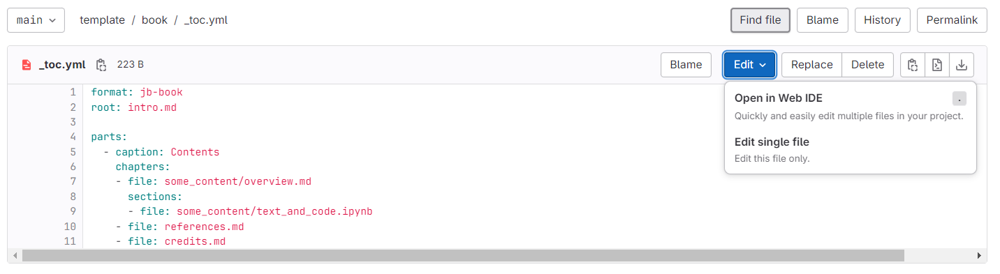
</figure>

You can edit it and commit the changes in the same manner as with markdown (.md) files.
````
````{tab-item} ... GitHub

In GitHub, you can directly make changes in the files on the remote repositery. You can make changes to the files already in the repositery using the text editor but you can also upload new files!

1. Navigate to the repositery you want to work in.

2. Create a new file by clicking on the button called `Add file` in the top bar. You can either create an entirely new file by clicking `Create new File` or if you already have created a file you can upload it by clicking `Upload files`.

<figure align="center">
    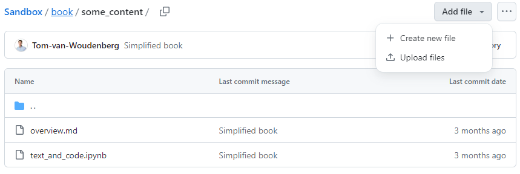
</figure>

3. In the new window, you can start typing your content. Give your file a name and make sure to use the markdown extension: `Chapter1.md`. Once you are done, commit the new file to the repositery by clicking the green button `Commit changes`.

<figure align="center">
    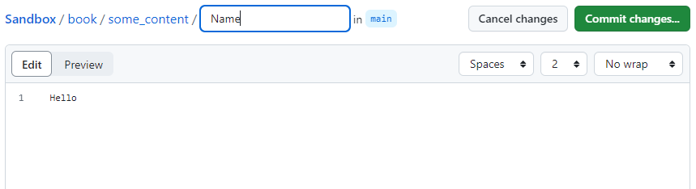
</figure>

4. In case you want to make changes to an existing file, navigate to the file in your remote repositery. Then click the downward pointing arrow on the very left in the top bar. Select the option `Edit in place`.

<figure align="center">
    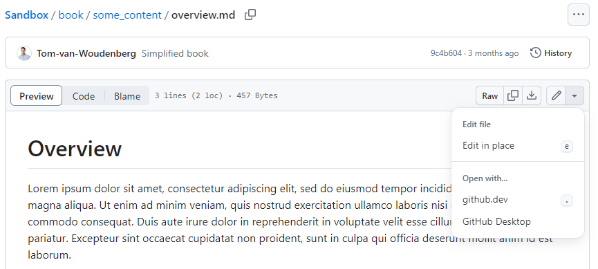
</figure>

5. Make your changes in the text editor and when you are ready, commit your changes to the remote repositery by clicking on the green `Commit changes` button.

<figure align="center">
    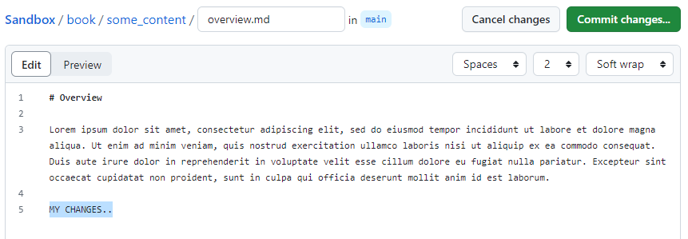
</figure>

6. In case you added a new file, you also need to include it table of contents of your book! The table of contents is specified in a file called `toc.yml` and it is already included in your repositery if you used the teachbooks template.

<figure align="center">
    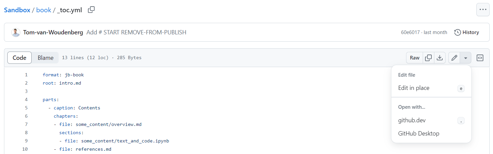
</figure>

You can edit it and commit the changes in the same manner as with markdown (.md) files.
````
`````
````````
````````{tab-item} ... user type 4 ...

```````{tab-set}
``````{tab-item} ... for a brand new version (branch)...

**... by (1) making changes on a single or multiple file(s) <br> 
         (2) selecting changes to be added to the Git-timeline (staging) <br>
         (3) adding changes to the Git-timeline (committing) and <br>
         (4) adding changes to GitLab/GitHub (pushing) with ...**

`````{tab-set}
````{tab-item} ... Git in VS Code

1. Make some changes to a file in for example VS Code and save them.

2.  Select the files ready to be added to Git-timeline (staging) 

For demonstration purposes, we have created a new Markdown file called `new-chapter.md`, which we want to add to the book. Since this is a new file, Git has no knowledge about its existence yet. I.e., the file is *untracked*. To add new files to our repository, we need to *stage* and *commit* them. To do this, open the Source Control menu in the left side bar. Our new file should appear in this menu:

```{figure} ../images/git-new-file.png

The new file appears in the Source Control menu.
```

Notice that there is a green letter U placed besides the file, meaning that our file is untracked. To add a file to the *staging area*, click on the + that appears when you hover over the file. 

3. Adding changes to the Git-timeline (committing)

Next, in the field that says "Message", write a short description of the changes you have made. This message is what is called the *Commit Message*. After we've done this, the menu should now look something like this:

```{figure} ../images/git-file-added.png

The new file has been staged, and we've written a Commit Message.
```
Now, we are ready to add the changes to the repository. This is done by *committing* the staged changes. To do this, simply press the big, blue "Commit" button in the Source Control menu. 

In the bottom left corner, next to the branch name, click the "Synchronize Changes" button (the one that looks like this: 🔄, highlighted in the image below) to push the changes to GitLab.

```{figure} ../images/git-push.png

After committing, click the 🔄 button to push our changes to the remote repository.

````
````{tab-item} ... GitHub Desktop

1. Make some changes to a file in for example VS Code and save them.

2. The staging GitHub Desktop assumes you want to stage all files. These files will show up on the left side bar when you open GitHub Desktop. You can unselect some of them (unstaging them) by clicking on the *check*. 

<figure align="center">
    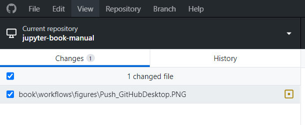
</figure>

3. Add changes to Git-timeline locally (committing). In the field that says `Summary(Required)`, write a short description of the changes you have made. This message is what is called the *Commit Message*. After we've done this, click the blue button `Commit to Repositery`.

4. Now we need to add changes to GitHub/GitLab. This is called pushing to the local repositery. After committing, the following screen will pop up. Click on `Push Origin`.

<figure align="center">
    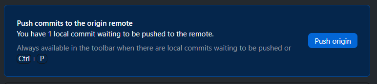
</figure>

Alternatively, you can also click on `Push origin` in the top bar. 

<figure align="center">
    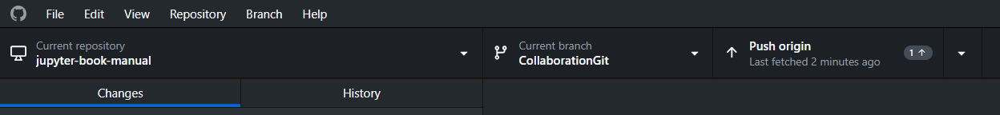
</figure>
````
`````
``````

``````{tab-item} ... for an existing version (branch)...

**... by (1) regularly obtaining updates from colleagues from GitLab/GitHub (pulling), <br>
         (2) solving potential incompatible changes (merging conflicts), <br>
         (3) making changes on a single / multiple file(s), <br>
         (4) selecting changes to be added to the Git-timeline (staging), <br>
         (5) adding those to the Git-timeline (committing) and <br>
         (6) adding changes to GitLab/GitHub (pushing) with ...**

`````{tab-set}
````{tab-item} ... Git in VS Code

1. If you collaborate with colleagues on your branch, you can get the updates from your colleagues as well by pulling from GitLab/GitHub. This synchronizes the remote repositery with your local repositery on your machine. On the left side-bar click on the icon that looks like a branch. 

<figure align="center">
    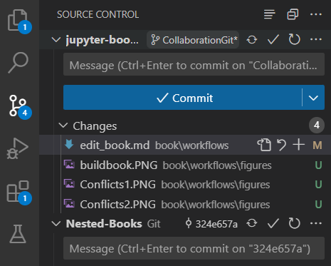
</figure>

By clicking on the 🔄 button, you will pull your colleages' changes.

2. When multiple people work on one chapter, it is possible that conflicts will arise if you and your colleagues have made incompatible changes in the same branch. In that case, when pulling from the remote repositery, Git in VS Code will recognize conflicts and help you to solve potential incompatible changes (merging conflicts). Open the files that are marked as conflicitng. 

<figure align="center">
    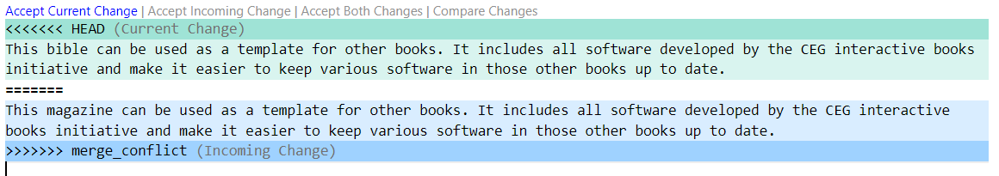
</figure>

The figure above shows the conflicts. If you look closely you can see that the last couple of words of the paragraph are different in the main branch than in the branch we were working in. There are a couple of options in the top bar: 

- `Accept Current Change` will keep the change in your branch
- `Accept Incoming Change` will keep the change from the main branch (the branch you are merging into your branch)
- `Accept Both Changes` will retain both paragraphs

Choose one of the options to resolve the merge conflict. You now have updated your work with work from your colleagues and resolved potential conlicts. You are now ready to continue working on the content.

3. Make some further changes to a file in for example VS Code and save them.

4.  Select the files ready to be added to Git-timeline (staging) 

For demonstration purposes, we have created a new Markdown file called `new-chapter.md`, which we want to add to the book. Since this is a new file, Git has no knowledge about its existence yet. I.e., the file is *untracked*. To add new files to our repository, we need to *stage* and *commit* them. To do this, open the Source Control menu in the left side bar. Our new file should appear in this menu:

```{figure} ../images/git-new-file.png

The new file appears in the Source Control menu.
```

Notice that there is a green letter U placed besides the file, meaning that our file is untracked. To add a file to the *staging area*, click on the + that appears when you hover over the file. 

5. Adding changes to the Git-timeline (committing)

Next, in the field that says "Message", write a short description of the changes you have made. This message is what is called the *Commit Message*. After we've done this, the menu should now look something like this:

```{figure} ../images/git-file-added.png

The new file has been staged, and we've written a Commit Message.
```
Now, we are ready to add the changes to the repository. This is done by *committing* the staged changes. To do this, simply press the big, blue "Commit" button in the Source Control menu. 

In the bottom left corner, next to the branch name, click the "Synchronize Changes" button (the one that looks like this: 🔄, highlighted in the image below) to push the changes to GitLab.

```{figure} ../images/git-push.png

After committing, click the 🔄 button to push our changes to the remote repository.
````
````{tab-item} ... GitHub Desktop

1. If you collaborate with colleagues on your branch, you can get the updates from your colleagues as well by pulling from GitLab/GitHub. This synchronizes the remote repositery with your local repositery on your machine. Click on `Fetch` in the top bar. Then on the same place, click on 'Pull'. 

<figure align="center">
    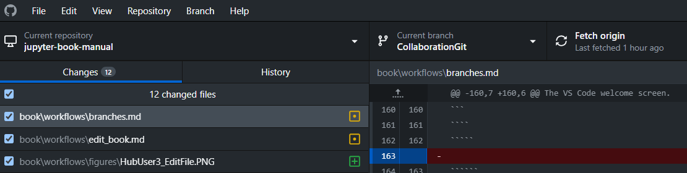
</figure>

2. When multiple people work on one chapter, it is possible that conflicts will arise if you and your colleagues have made incompatible changes in the same branch. In that case, when pulling from the remote repositery, GitHub Desktop will recognize conflicts and help you to solve potential incompatible changes (merging conflicts). 

<figure align="center">
    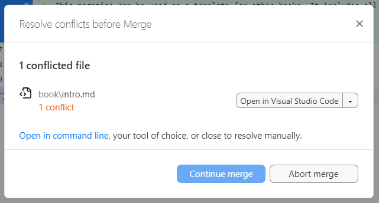
</figure>

In this case there are two conflicted files. GitHub Desktop is suggesting to resolve the changes in VS Code. Click on `Open in Visual Studio Code`. 

<figure align="center">
    
</figure>

The figure above shows the conflicts. If you look closely you can see that the last couple of words of the paragraph are different in the main branch than in the branch we were working in. There are a couple of options in the top bar: 

- `Accept Current Change` will keep the change in your branch
- `Accept Incoming Change` will keep the change from the main branch (the branch you are merging into your branch)
- `Accept Both Changes` will retain both paragraphs

Choose one of the options to resolve the merge conflict. You now have updated your work with work from your colleagues and resolved potential conlicts. You are now ready to continue working on the content.

3. Make some further changes to a file in for example VS Code and save them.

4. The staging GitHub Desktop assumes you want to stage all files. These files will show up on the left side bar when you open GitHub Desktop. You can unselect some of them (unstaging them) by clicking on the *check*. 

<figure align="center">
    
</figure>

5. Add changes to Git-timeline locally (committing). In the field that says `Summary(Required)`, write a short description of the changes you have made. This message is what is called the *Commit Message*. After we've done this, click the blue button `Commit to Repositery`.

6. Now we need to add changes to GitHub/GitLab. This is called pushing to the local repositery. After committing, the following screen will pop up. Click on `Push Origin`.

<figure align="center">
    
</figure>

Alternatively, you can also click on `Push origin` in the top bar. 

<figure align="center">
    
</figure>

````
`````
``````
```````
````````

````````{tab-item} ... User type 5 ...

```````{tab-set}
``````{tab-item} ... for brand new version (branch)

**... by (1) making changes on a single or multiple file(s) <br> 
         (2) checking changes locally, <br>
         (3) selecting changes to be added to the Git-timeline (staging) <br>
         (4) adding changes to the Git-timeline (committing) and <br>
         (5) adding changes to GitLab/GitHub (pushing) with ...**

`````{tab-set}
````{tab-item} ... Git in VS Code

1. Make some changes to a file in for example VS Code and save them.

2. Once all the changes are made, it can be useful to check the changes locally on your device in order to see how it will look on the website. If all the required environments and packages are downloaded, checking changes locally is fairly easy! 

Navigate to the terminal in VS code, located at the bottom of the window or by clicking on `Terminal` in the top bar.
You will firstly need to actiavte the right environment. Type the following command:

`conda activate jupyter-book-env`

(or the environment in which you have installed the TeachBooks package)

Then we can build the book locally. Make sure you are in the right repositery in VS code and type the folloing command:

`jupyter-book build book` 

Where book is the name of the folder containing all the files that make up your book. After `jupyter-book` is done running you will get the following:

```{figure} ../figures/buildbook.PNG

Output.
```
Paste the last line into your browser to see the updated changes. 

```{Note} 

Sometimes there are problems building the book. It could be that the building requires extensions that are not present in your environment. To prevent issues, make sure to update your environment by routinely updating your packages. You can do this by executing the following line in your environment in the command line.

`pip install -r requirements.txt --upgrade`

```jup
3. If you are satisfied with your changes, you can select the files ready to be added to Git-timeline (staging) 

For demonstration purposes, we have created a new Markdown file called `new-chapter.md`, which we want to add to the book. Since this is a new file, Git has no knowledge about its existence yet. I.e., the file is *untracked*. To add new files to our repository, we need to *stage* and *commit* them. To do this, open the Source Control menu in the left side bar. Our new file should appear in this menu:

```{figure} ../images/git-new-file.png

The new file appears in the Source Control menu.
```

Notice that there is a green letter U placed besides the file, meaning that our file is untracked. To add a file to the *staging area*, click on the + that appears when you hover over the file. 

4. Adding changes to the Git-timeline (committing)

Next, in the field that says "Message", write a short description of the changes you have made. This message is what is called the *Commit Message*. After we've done this, the menu should now look something like this:

```{figure} ../images/git-file-added.png

The new file has been staged, and we've written a Commit Message.
```
Now, we are ready to add the changes to the repository. This is done by *committing* the staged changes. To do this, simply press the big, blue "Commit" button in the Source Control menu. 

In the bottom left corner, next to the branch name, click the "Synchronize Changes" button (the one that looks like this: 🔄, highlighted in the image below) to push the changes to GitLab.

```{figure} ../images/git-push.png

After committing, click the 🔄 button to push our changes to the remote repository.

```{Error}

5.  startup python server...

````

````{tab-item} ... GitHub Desktop

1. Obtain updates from colleagues from GitLab/GitHub (pulling). This synchronizes the remote repositery with your local repositery on your machine. Click on `Fetch` in the top bar. Then on the same place, click on 'Pull'. 

<figure align="center">
    
</figure>

2. When multiple people work on one chapter, it is possible that conflicts will arise. This means that two users might have cheanged the same sections. GitHub Desktop will recognize this Solve potential incompatible changes (merging conflicts)

3. Make some changes to a file in for example VS Code and save them.

4. The staging GitHub Desktop assumes you want to stage all files. These files will show up on the left side bar when you open GitHub Desktop. You can unselect some of them (unstaging them) by clicking on the *check*. 

<figure align="center">
    
</figure>

5. Add changes to Git-timeline locally (committing). In the field that says `Summary(Required)`, write a short description of the changes you have made. This message is what is called the *Commit Message*. After we've done this, click the blue button `Commit to Repositery`.

6. Now we need to add changes to GitHub/GitLab. This is called pushing to the local repositery. After committing, the following screen will pop up. Click on `Push Origin`.

<figure align="center">
    
</figure>

Alternatively, you can also click on `Push origin` in the top bar. 

<figure align="center">
    
</figure>

Python stuff?

````
`````
``````

``````{tab-item} ... for an existing version (branch)

**... by (1) regularly obtaining updates from colleagues from GitLab/GitHub (pulling), <br>
         (2) solving potential incompatible changes (merging conflicts), <br>
         (3) making changes on a single / multiple file(s), <br>
         (4) checking changes locally, <br>
         (5) selecting changes to be added to the Git-timeline (staging), <br>
         (6) adding those to the Git-timeline (committing) and <br>
         (7) adding changes to GitLab/GitHub (pushing) with ...**

`````{tab-set}
````{tab-item} ... Git in VS Code

**Eventually solve conflicts with combining versions (merge conflicts, emerges after pulling)**

If you collaborate with colleagues on this branch, you can get the updates from your colleagues as well by pulling from GitLab/GitHub. Now your branch is up-to-date. However, this might lead into a merge conflict if you and colleagues have made incompatible changes. How to solve that?

```{error} To be written
```
````
````{tab-item} ... GitHub Desktop

text..
```{error} To be written
```
````
`````
``````
```````
````````
`````````