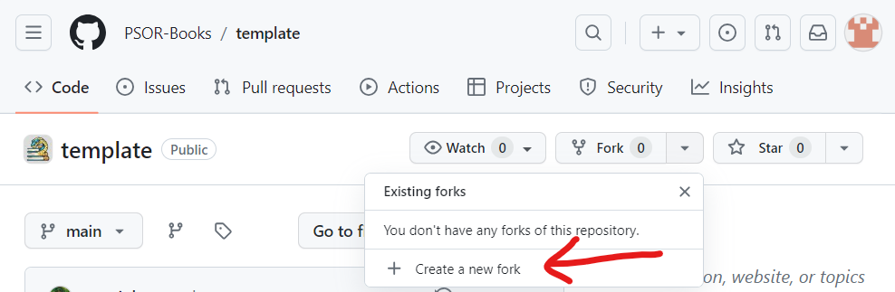
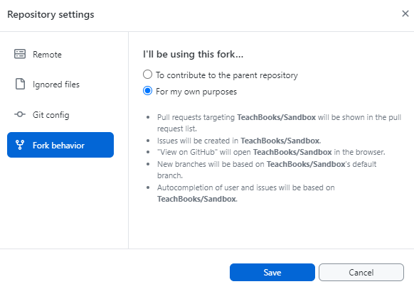

# Example using our GitHub template

This page shows you how as an example how to create your own Jupyter Book. It including making an edit to a predefined book and hosting that book online. It doesn't elaborate on the collaborative functionalities of Git.

## Setting up and first baby-editing-steps

### Step 1: Fork book
To get started making your Jupyter Book with our functionalities, fork our template book https://github.com/TeachBooks/template :

Fill in a repository name, this name will be used in the future url of your book:

### Step 2: Setup GitHub pages with provided Actions
Set up the build of your website using GitHub pages by selecting under `Settings` - `Pages` - `Build and deployment` - `Source` - `GitHub Actions`:

Enable the predefined workflow to publish your book under `Actions` - `I understand my workflows, go ahead an enable them`:

### Step 3: Edit the book!
Edit a file under `Code` - `book` - A file of your choice - `Edit in place`, in the example below `book/intro.md` is edited:

Make your edit and `Commit changes` to `main` branch:

### Step 4: Have a look at the Action
Wait a few minutes for the website to be deployed, if you're curious, have a look at the progress under `Actions` - `All workflows`:

### Step 5: Visit published website
When the workflow has finished, visit your build book at `https://<username>.github.io/<repository_name>` (case sensitive). For our example it is: [https://dummystudent-Tom.github.io/My_own_book](https://dummystudent-Tom.github.io/My_own_book) :

---

It is possible to have multiple versions of a book published at once, by creating another Git branch (e.g. `draft` or `dev`).
For each branch, the respective book is published at `https://<username>.github.io/<bookname>/<branchname>`.
Technical note: for convenience, just `.../<bookname>/` redirects to `.../<bookname>/book/`, which is itself an alias (a symlink) for 
`.../<bookname>/main/`.

To learn more about how we do this, please see the [GitHub Actions documentation](https://docs.github.com/en/actions) and our deployment pipeline configuration file `.github/workflows/deploy-book-ghpages.yml` [here](https://github.com/TeachBooks/template/blob/main/.github/workflows/deploy-book-ghpages.yml).

## Working with GitHub Desktop on this fork

Whenever you continue working on this forked template using GitHub Desktop, make sure you select the `For my own purposes` option at `I'll be using this fork...` in the `Fork behavior` tab in `Repository settings`. This will streamline the process:

