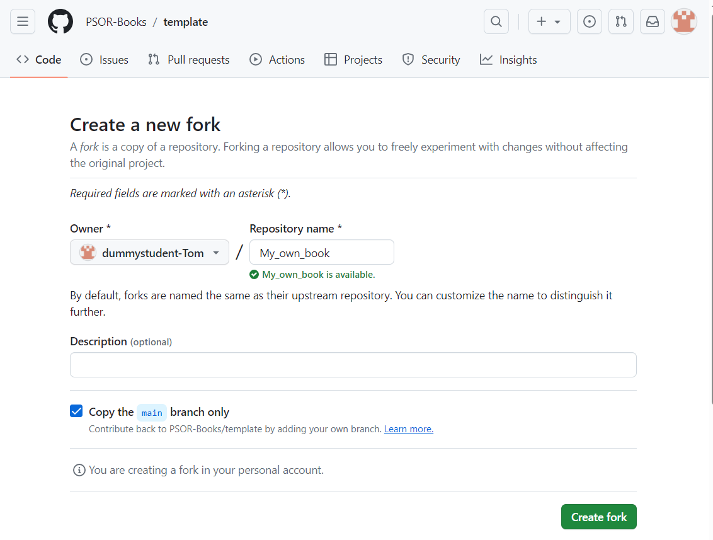
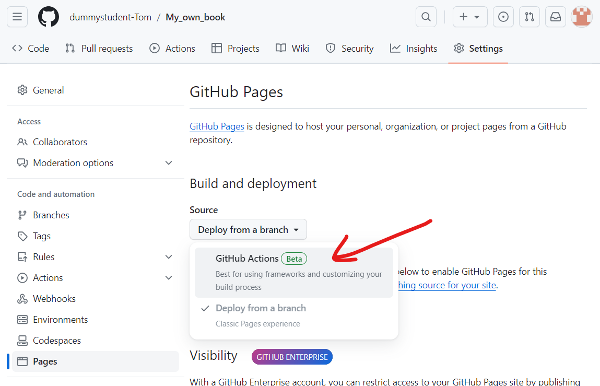
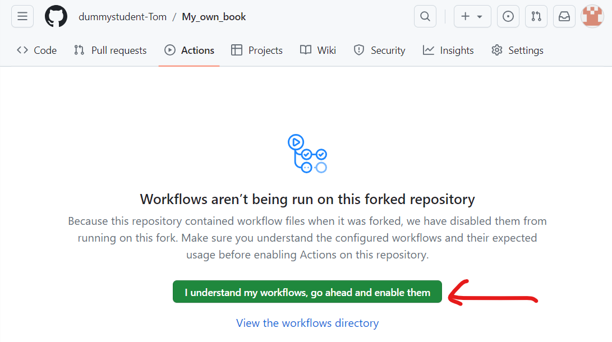
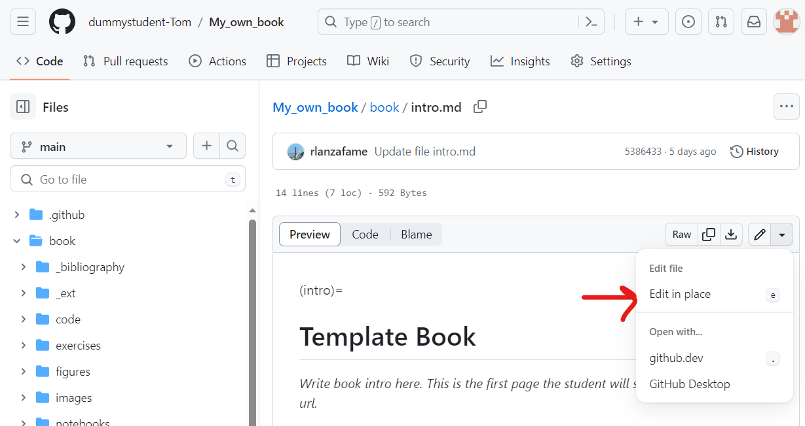
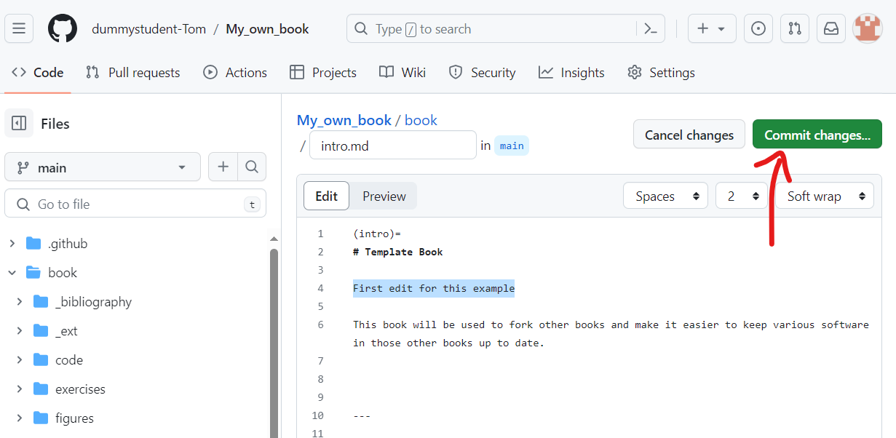
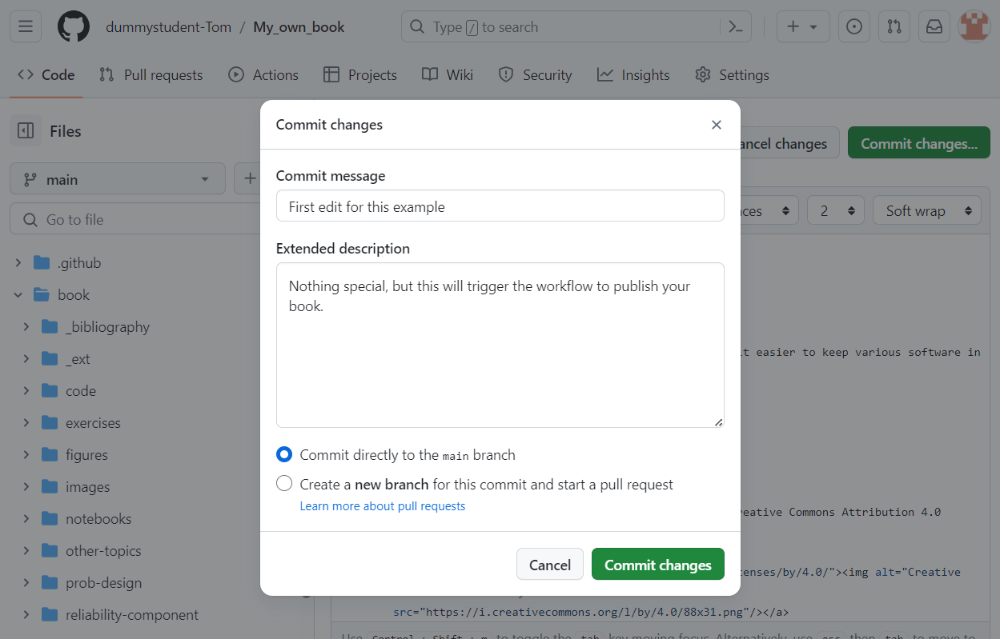
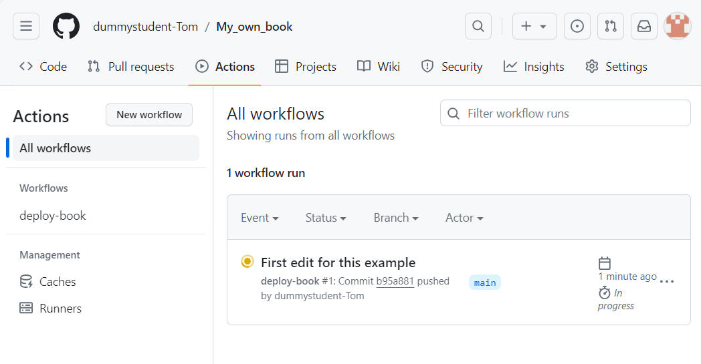
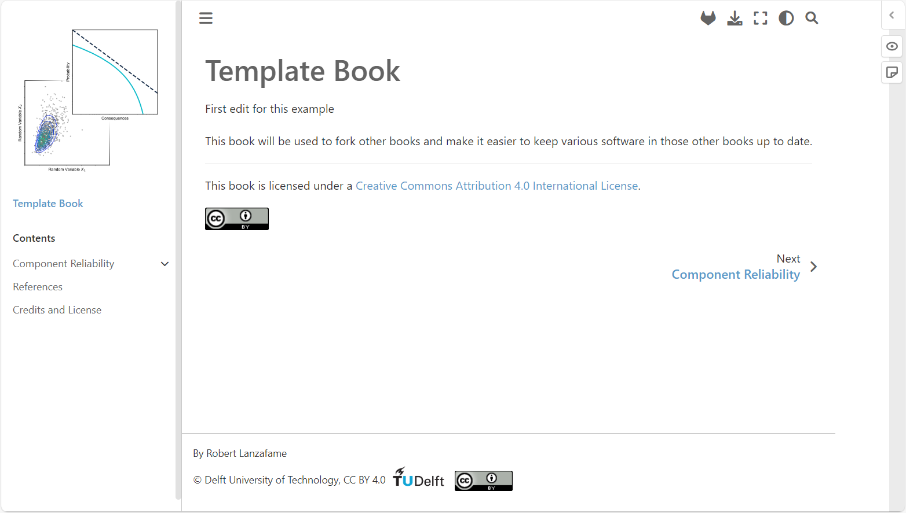

# GitHub template

To get started making your Jupyter Book with our functionalities, fork our template book https://github.com/PSOR-Books/template :

Fill in a repository name, this name will be used in the future url of your book:

Set up the build of your website using GitHub pages by selecting under `Settings` - `Pages` - `Build and deployment` - `Source` - `GitHub Actions`:

Enable the predefined workflow to publish your book under `Actions` - `I understand my workflows, go ahead an enable them`:

Edit a file under `Code` - `book` - A file of your choice - `Edit in place`, in the example below `book/intro.md` is edited:

Make your edit and `Commit changes` to `main` branch:

Wait a few minutes for the website to be deployed, if you're curious, have a look at the progress under `Actions` - `All wokflows`:

When the workflow has finished, visit your build book at https://<username>.github.io/<repository_name> (case sensitive). For our example it is: https://dummystudent-tom.github.io/My_own_book:

