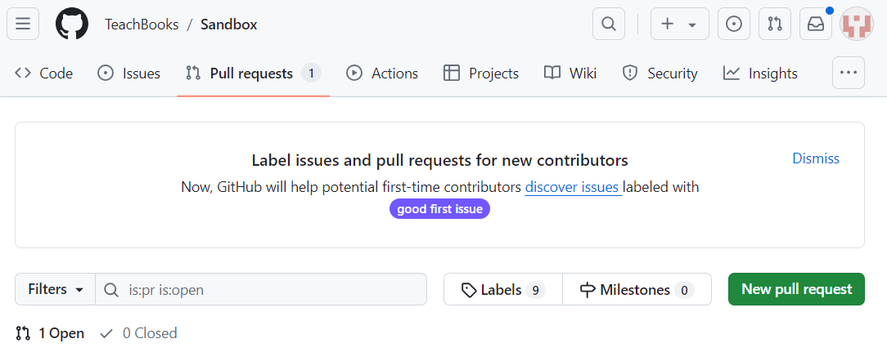
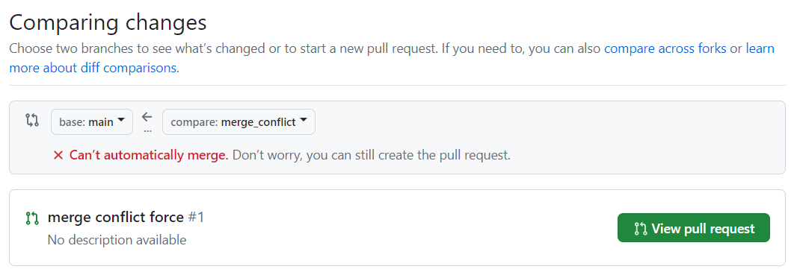
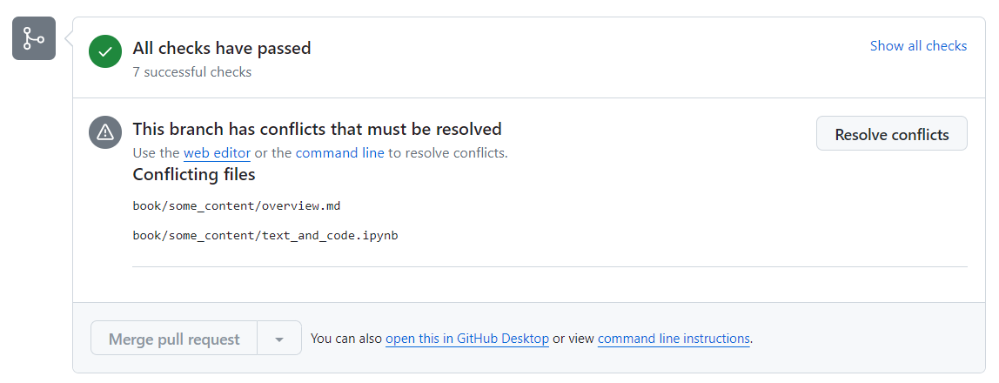
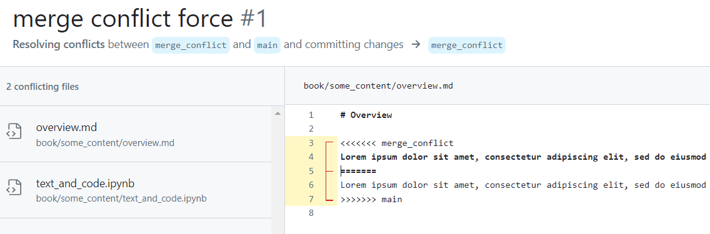
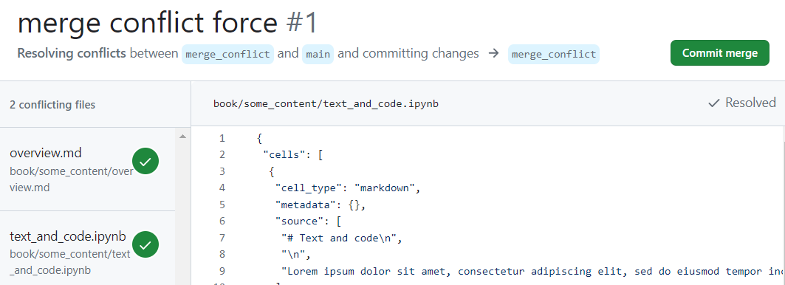
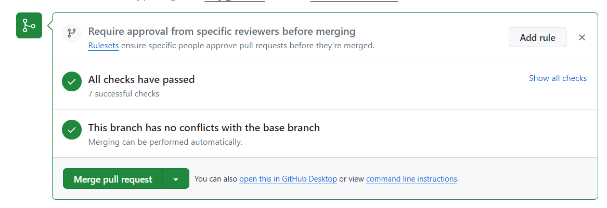

# Reviewing and combine versions (merge / pull request, merging)

Merging a branch into the main branch is also good moment to let a team-member review the content. By assigning a colleague to review your branch you can check the quality of your new content. 

```{note}
There is a slight difference in terminology between GitLab and GitHub. GitLab uses the term *Merge* Request while GitHub uses the term *Pull* Request. Both actions refer to the merging of a branch into the main branch.
```

We're finished with our chapter, and now it's time to include all of our commits in the `main` branch. However, it's good practice to first merge `main` into our branch, so that we can see if there are any merge conflicts. Assuming that those merge conflicts are solved before, we'll now continue this example with the following merge of our branch into `main`.

`````{tab-set}
````{tab-item} In GitLab

1. Make sure that you've committed all your new sections and changes, and that they're pushed to the remote repository.

2. Go the repository overview on GitLab. In the left menu bar, go to "Merge requests". On the Merge requests page, click "New merge request". 

3. You can now choose a source branch and a target branch. Since we want to merge our changes from `chapter-2` *into* `main`, `chapter-2` is the source branch and `main` is the target branch ({numref}`gitlab-merge-request`) . Once you've selected the correct branches, click "Compare branches and continue".

```{figure} ../images/gitlab-merge-request.png
:name: gitlab-merge-request

Creating a new merge request to merge `chapter-2` into `main`.
```

4. On the next page, you can give your merge request a name, and provide a description of your changes ({numref}`gitlab-merge-request-description`). If somebody has to review your changes, you can add them in the "Reviewer menu". They will then be notified via email that they need to review your work. Finally, watch out for the option "Delete source branch when merge request is accepted". If you want to keep working on the same branch, even after your previous work has been merged, make sure you untick the box! Once everything is filled in, click "Create merge request".

```{figure} ../images/gitlab-merge-request-description.png
:name: gitlab-merge-request-description

Example of a filled-in merge request.
```
5. After clicking `create merge request` you should land on the following page. Here, you can track the merge request. Right after your request, GitLab will do some checks to see if you've tried to merge conflicting files. As you can see in the figure below the merge is blocked due to the conflicts. Click on 'Resolve conflicts`. 

```{figure} ../figures/Merge_Request_GitLab.PNG
:name: gitlab-merge-request-conflict

Example of a blocked merge.
```

Clicking on 'Resolve conflicts`, will open the conflicted files in the text editor. There you can manually edit the files to the version you would like to retain. By clicking on `use ours` or `use theirs` you can select which version you would like to keep.

```{figure} ../figures/Solve_Conflict.PNG
:name: gitlab-conflict

Solving the conflict.
```
Once you are done, click on `Commit to source branch`. Do this for all conflicted files. Note that if your branches do not have conflicting changes you can merge directly and skip this step. In that case you can skip ahead to the next step.

In case you have cloned the repositery you can also resolve the conflicts locally using VS Code for example. You can read more about for [GitHub Dekstop](edit_book.md#... GitHub Desktop) or [VS Code](edit_book.md#... VS Code)

6. On the page of our merge request ({numref}`gitlab-finished-merge-request`), we're greeted with some more information. On top, you can read the description we just provided when creating the merge request. We can also see an "Approve" button, which you may or may not see, depending on your repository rights. Next, we can see a green checkmark, with a "Merge" button. This is good news: our changes do not conflict with existing files on the `main` branch, and we can merge our changes directly by clicking the button (if applicable: only after somebody else approved the request). 

```{figure} ../../images/gitlab-finished-merge-request.png
:name: gitlab-finished-merge-request

The finished merge request.
```
````

````{tab-item} In GitHub

1. Make sure that you've committed all your new sections and changes, and that they're pushed to the remote repository.

2. In GitHub, navigate to the repositery you want to work in. In the top bar click `Pull Requests`. Then, in the new window click on `New Pull Request`. 

<figure align="center">
    
</figure>

3. You can now choose a base branch and a compare branch. 

- Base Branch: The base branch is the branch into which you want to merge your changes.
- Compare Branch: The compare branch, also known as the "head" branch, is the branch that contains the changes you want to merge into the base branch.

<figure align="center">
    
</figure>

In the figure, you can see that we want to merge our changes from the branch `merge_conflict` *into* `main`, `merge_conflict` is the compare branch and `main` is the base branch. Note that in the figure it says that the branches cannot be automatically merged. The reason for this is that there are conflicts in the two branches, which you can see when scrollong down. 

You can still create the pull request but you will have to manage the conflicts. Once you've selected the correct branches, click `View Pull Request`.

4. As previously mentioned, before merging the two branches we have to resolve the conflicts. Click on 'Resolve conflicts`. Note that if your branches do not have conflicting changes you can merge directly and skip this step.

<figure align="center">
    
</figure>

Clicking on 'Resolve conflicts`, will open the conflicted files in the text editor. There you can manually edit the files to the version you would like to retain. 

<figure align="center">
    
</figure>

Once you are done, click on `mark as resolved` in the top right of the window. Do this for all conflicted files. 
In case you have cloned the repositery you can also resolve the conflicts locally using VS Code for example. You can read more about it [here](edit_book.md#... GitHub Desktop)

5. Commit the changes by clicking on `Commit merge`. 

<figure align="center">
    
</figure>

6. You can now complete the pull request by clicking `merge pull request`.

<figure align="center">
    
</figure>
````
````{tab-item} Locally with GitHub Desktop for GitHub repositories
hi
````
`````
