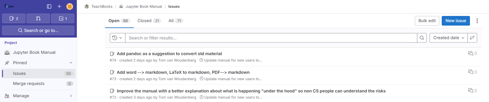
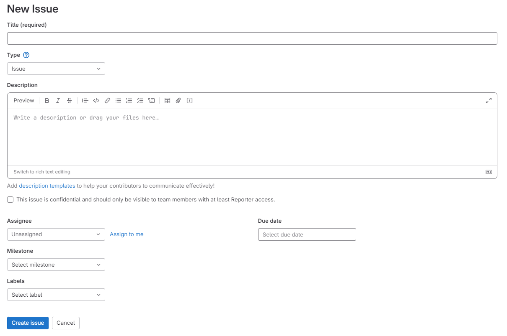
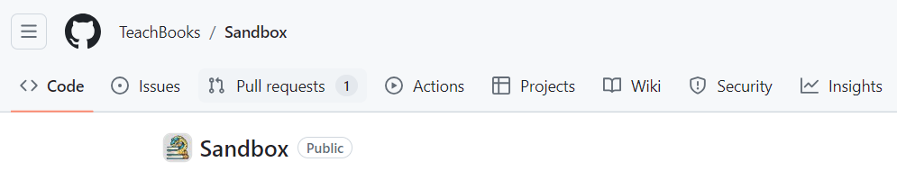
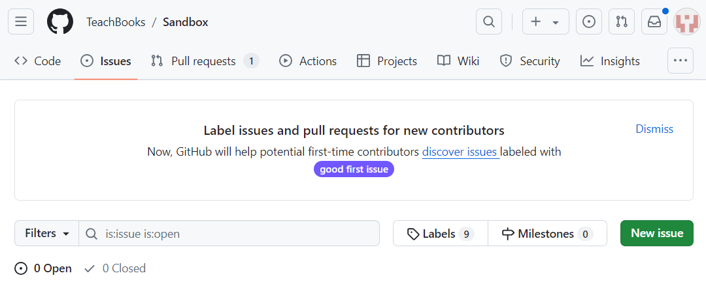
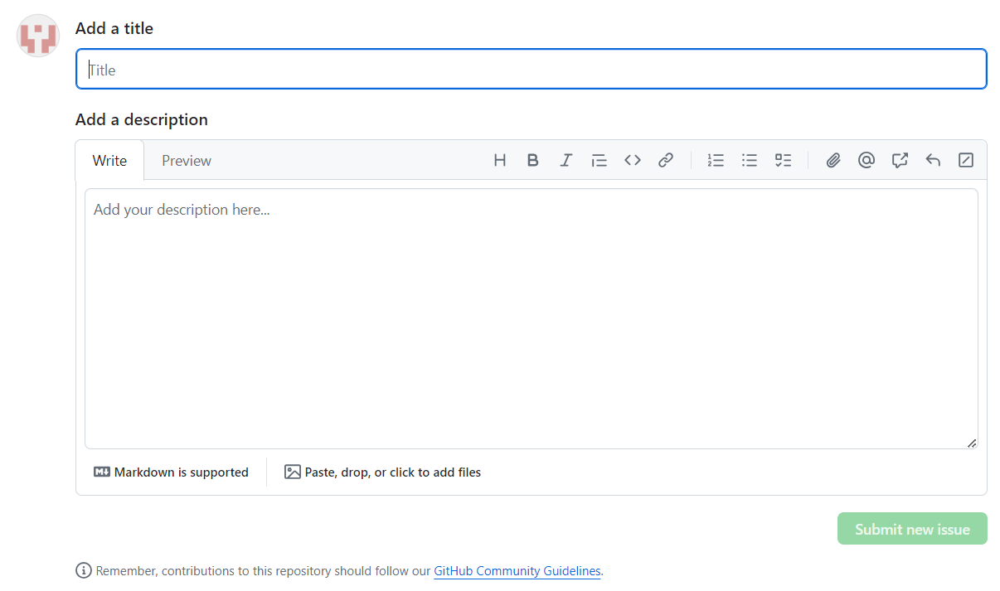

# Assign task to yourself (milestones, issues)

In a repository, team members can define Milestones and Issues. Milestones are used to track the overall progress of the project to make sure that deadlines are met. A milestone can group many issues, which are individual tasks that need to be finished in order to reach the milestone.

An issue is built up of the following attributes:
- the title, this should just be a quick description of the task 
- a label, to assign a category to the task such as: new content
- an assignee, the person who created the task can assign a team-member to the task or the task can remain without an assignee. Then whoever would like to pick up the task can assign it to themselves!
- a discussion section, here team-members can discuss any questions about the task
- a due date, in case the task is urgent or to keep track of deadlines

Every team member can create issues when they think of a task that would improve the book.

**Make and assign task to yourself (issues) in ...**

`````{tab-set}
````{tab-item} ... GitLab

The issues in GitLab can be found in your repositery in the left bar. 



You can create an issue by clicking on the blue `New Issue` button in the top right corner. <br>
This will lead you to this window where you can specify all attributes we mentioned before!



````

````{tab-item} ... GitHub

The issues in GitHub can be found in your repositery in the top bar.

 <br>

Clicking on `Issues` will open up the page with all the issues on this repositery.

 <br>

Finally, by clicking the green `New Issue` button you can create a new issue and specify all the attributes we mentioned before!

 <br>
````
`````

When the task is completed, the issue can be closed and you can move on to the next!